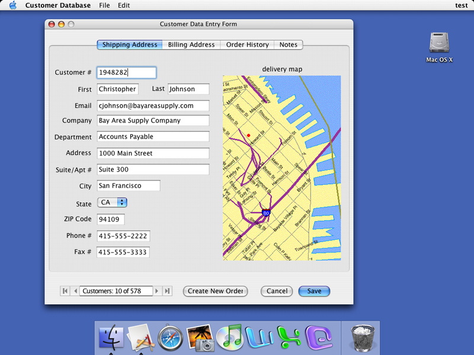



## How to create Linux &amp; MacOS Programs using existing VB code

### Description

This product review shows how you can take your existing VB code and push it to the Macs - or Linux. DOES work. I have tried it myself using a friends Macintosh. PLEASE VOTE FOR ME! I wanna be loved! And comments rock too! BUt not as much as votes :P
 
### More Info
 

             |
---                |---
**Submitted On**   |
**By**             |[Grayda](https://github.com/Planet-Source-Code/PSCIndex/blob/master/ByAuthor/grayda.md)
**Level**          |Beginner
**User Rating**    |4.0 (32 globes from 8 users)
**Compatibility**  |VB 5\.0, VB 6\.0
**Category**       |[Miscellaneous](https://github.com/Planet-Source-Code/PSCIndex/blob/master/ByCategory/miscellaneous__1-1.md)
**World**          |[Visual Basic](https://github.com/Planet-Source-Code/PSCIndex/blob/master/ByWorld/visual-basic.md)
**Archive File**   |

### Source Code

Before I reveal the product name, let me run over some features this program has
 
 
<ul>
<li>Create TRUE cross-platform programs</li>
<li>NO external libraries required</li>
<li>Coding language is EXTREMELY Similar to that of VB6</li>
<li>80% of commands, keywords etc. the same</li>
<li>Has internal socket support for HTTP, SSL, POP3, SMTP</li>
<li>Has easyTCP & easyUDP for n00bs to sockets</li>
<li>FULL online help, no MSDN CDs needed! :)</li>
<li>Alternating colours for Listboxes? Can be done!</li>
<li>EditField Control takes over RTB controls</li>
<li>Can load existing Active-X controls etc.</li>
<li>VB Project converter for your VB Apps</li>
<li>Integrated graphics support. No DirectX Needed. Create games & 3D Apps using included Controls</li>
<li>Plus HEAPS more features</li>
</ul>
 
 
I'm using the 10 day trial, which has support for Mac Classic, MacOS X and Windows apps (People with NT and 98 don't miss out!)
 
 
Here's some VB code compared to this program's code:
Public Sub DoStuff(Input as string, YourName as string, YourAge as integer)
 
 
Msgbox YourName + ' (aged ' + YourAge ' years young), you said ' + Input
 
 
End Sub
 
 
Public Sub DoStuff(Input as string, YourName as string, YourAge as integer)
 
 
Msgbox YourName + ' (aged ' + YourAge ' years young), you said ' + Input
 
 
End Sub
 
 
Notice any difference? No? Thats coz is there is none! It's almost exactly the same!
 
 
Sure, you say, this program is cool, but why should I ditch VB?
 
 
Easy! VB is no longer supported by Microsoft. RealBasic is growing all the time! And isn't Microsoft ripping you of all your cash already with windows? Spread the cash around!
 
 
So what is this program?
It's RealBasic! You can get the demo from www.realbasic.com. Believe me, I might ditch VB (sorry)and turn to RealBasic. I might even PAY to own the full copy!
 
 
Enjoy! And say 'Thankyou Grayda' for this!
Remember, comment and vote!

